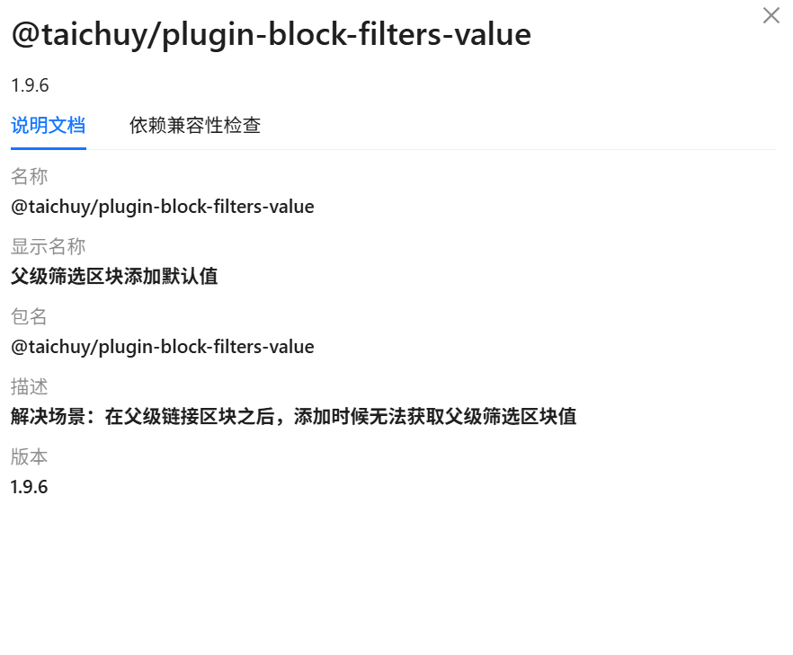
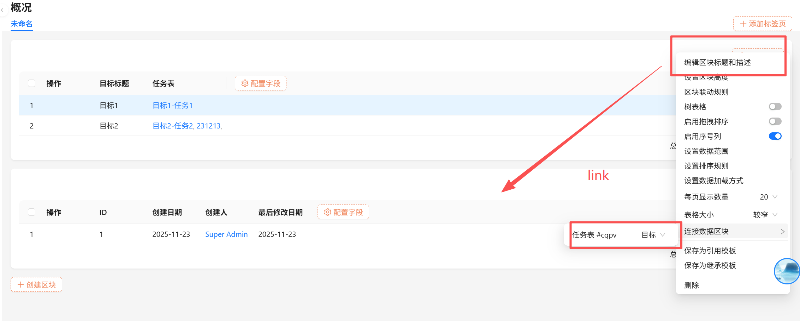
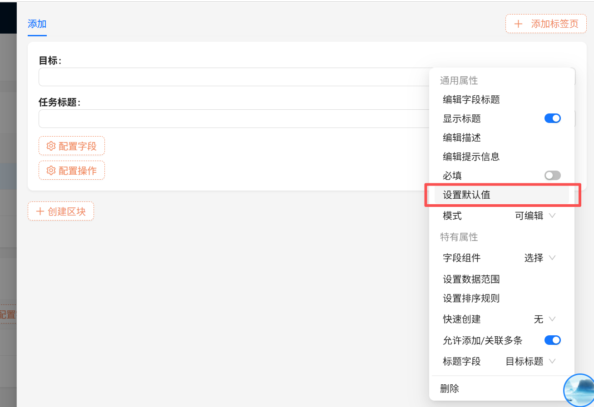
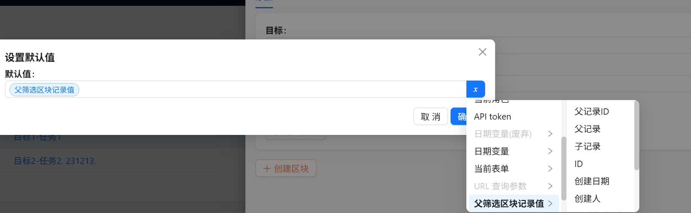

---
title: Parent Filter Value Transfer
order: 2
---

# Parent Filter Value Transfer Plugin

> Scenario: In a page, after a parent link block, the parent filter block value cannot be retrieved when adding a new record.
>
> Problem: For example, linking other blocks via a table block, but finding it impossible to add a parent record when creating new entries.
>
> Solution: After using this plugin, you can directly use the parent block's parent value.

This feature is provided by the plugin: ``@taichuy/plugin-block-filters-value``

Enable the plugin

First, connect the block:

Set default values in the creation form:

After clicking OK, we can retrieve the value from the parent record object in the form. Simple, isn't it? Give it a try!

