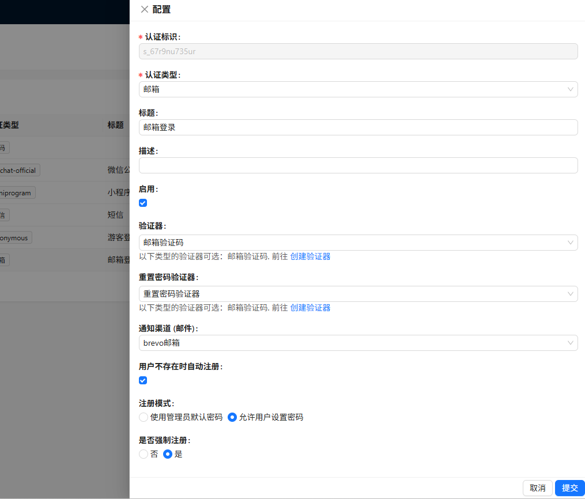
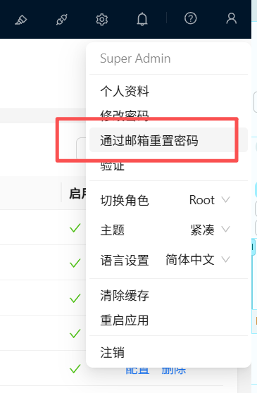
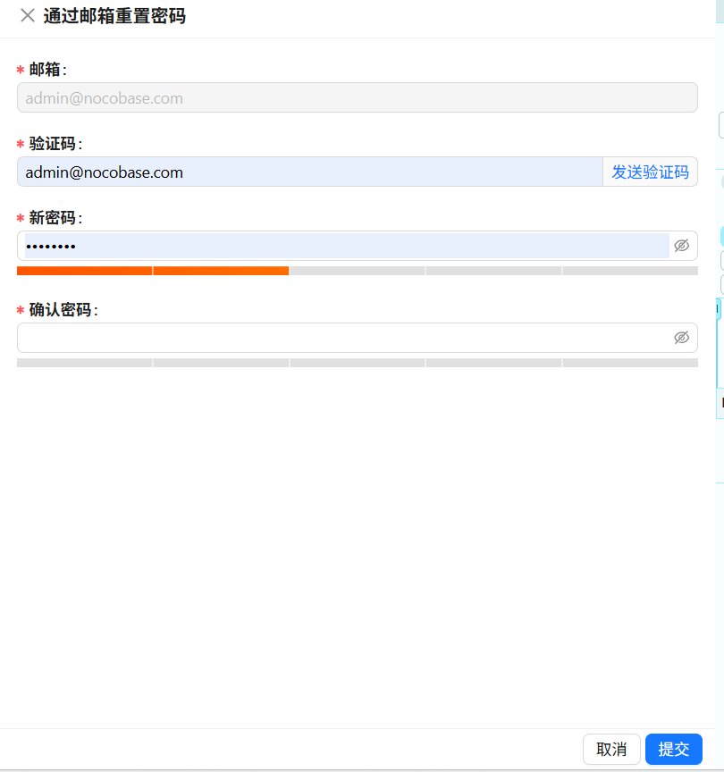

---
title: plugin-auth-email
order: 0
toc: content
---

# Taichu y Plugin - Email Authentication

## Introduction (Paid)

Enable the plugin to support email registration and login authentication in NocoBase.


### Fees:

| License Type                     | Price          | Benefits                                                                                                                                            | Suitable Scenarios                                                                     |
| :------------------------------- | :------------- | :-------------------------------------------------------------------------------------------------------------------------------------------------- | :------------------------------------------------------------------------------------- |
| **Package License**              | $49            | 1. Plugin installation package for a specific version<br>2. One-time purchase, permanent use license<br>3. Basic installation guidance              | Stable deployment in production environment without frequent updates                   |
| **Package + Source Code Access** | $99/First Year | 1. All benefits of the package license above<br>2. One year of access to the GitHub private repository<br>3. Continuous update support for one year | Need to follow NocoBase upgrades or require secondary development based on source code |
| **Source Code Renewal**          | $49/Year       | 1. Continued access to the GitHub private repository after renewal<br>2. Continuous update support during the renewal period                        | Existing package users who want to continue receiving updates                          |

For details, please visit: https://docs.taichuy.com/nocobase

## 1. Dependency Plugin Check:

The email verification plugin requires the following official native plugins to be enabled for complete verification code sending.


The following email notification plugin is not enabled by default and needs to be enabled in the plugin manager.


## 2. Configure Email Verification:


Example of my personal 163 email configuration for notifications:


## 3. Configure Verification Code and Email Content:


Email verification code configuration:

Note:

```shell
Your verification code is {{code}}
```

`{{code}}` is mandatory; it is the placeholder for the randomly generated verification code.


Email content supports HTML. You can use AI to generate custom HTML for your emails.


## Final - Configure User Authentication


### Configuration Example:

After enabling automatic login for non-existent users:

1. Supports using a default password set by the administrator during automatic registration.
2. Supports users registering and setting their own passwords first, then one-click registration and login.
3. Supports email password reset with a specified verification code verifier.




## Email Password Reset (Optional)

Once configured, it supports resetting user passwords via email. The user's email will be automatically retrieved. For security reasons, it only reads the user's email in read-only mode.





## About Email Verification (Optional)


NocoBase has a verification feature. I noticed it exists for SMS, where SMS verification login is only possible if SMS verification is enabled. I've implemented a similar feature here. However, I haven't made it mandatory; email login is still possible without binding, but I've included it as it might be useful for some users later.


After binding the email, the user's email field attribute will be automatically updated.
