# Taichu y Plugin - Email Authentication Plugin

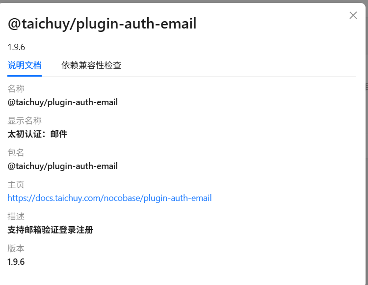

## 1. Dependency Check:

The Email Authentication plugin requires the following official native plugins to be enabled for full verification code delivery.

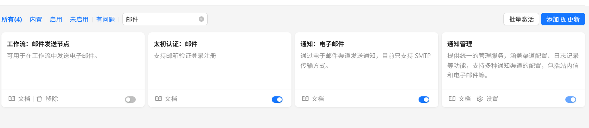

The following email notification plugin is not enabled by default and needs to be enabled in the plugin manager.

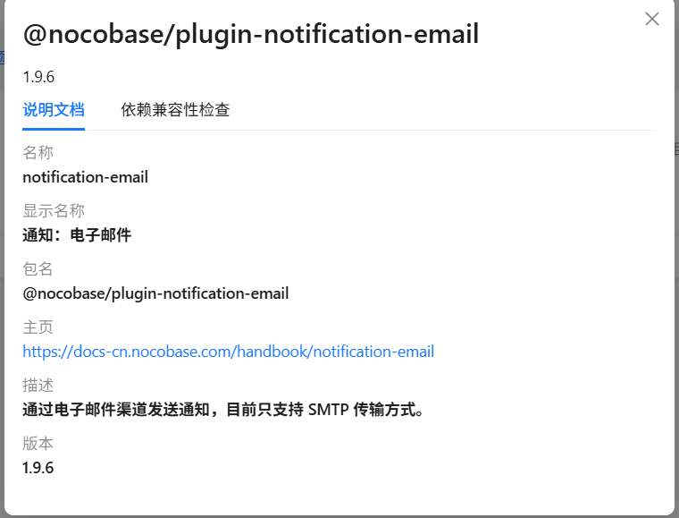

## 2. Configure Email Verification:

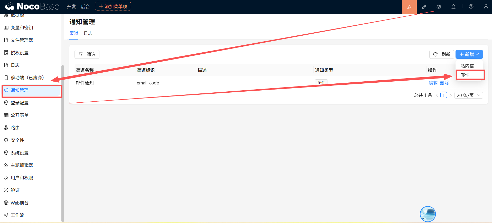

Below is an example of my personal 163 email configuration for notifications:
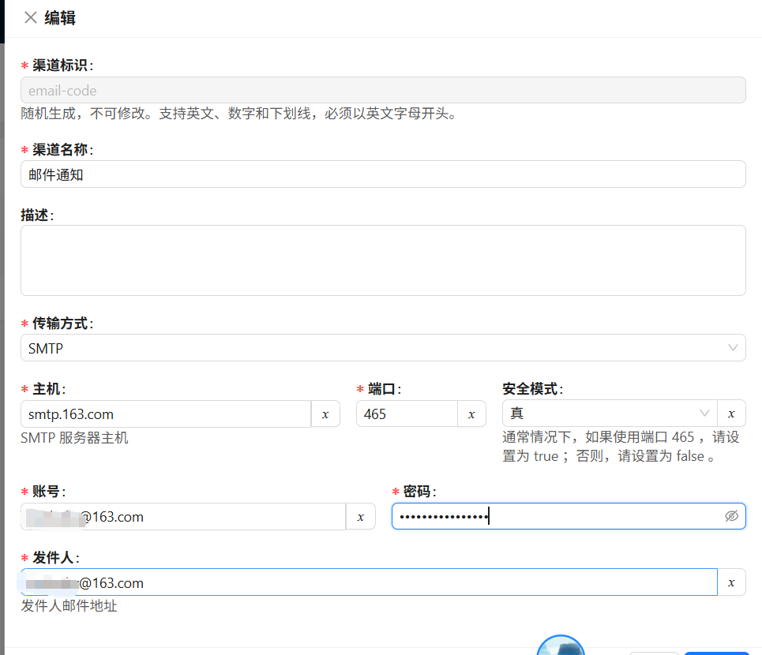

## 3. Configure Verification Code and Email Content:

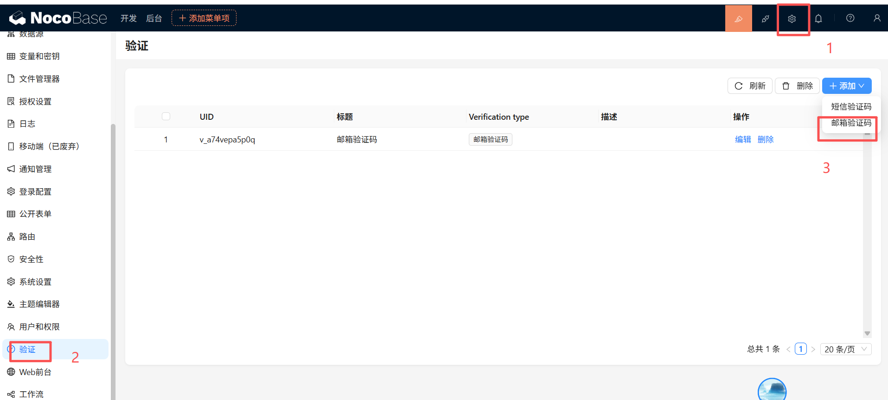

Email verification code configuration content:

Where:

```shell
Your verification code is {{code}}
```

`{{code}}` is mandatory, as it serves as the placeholder for the randomly generated verification code.

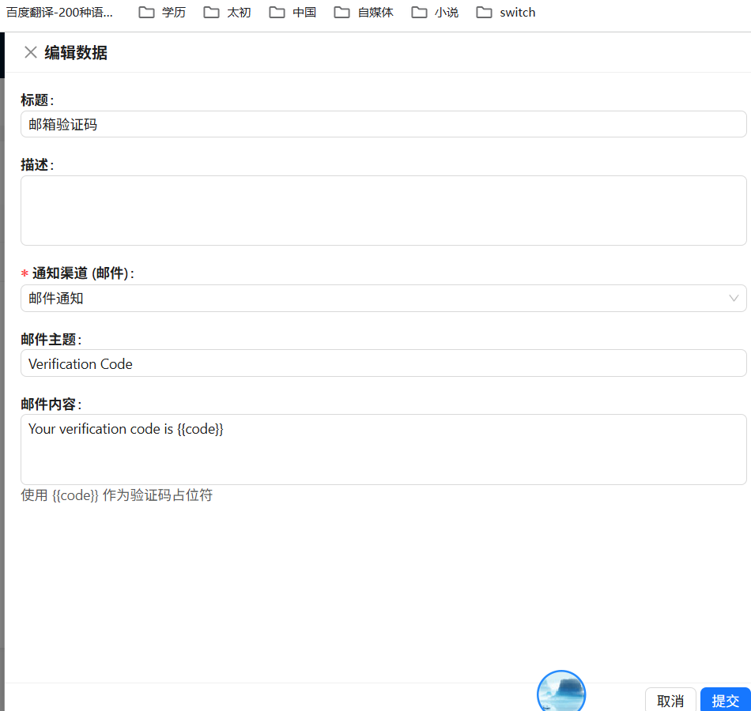

## Final Step - Configure User Authentication


Configuration content example:

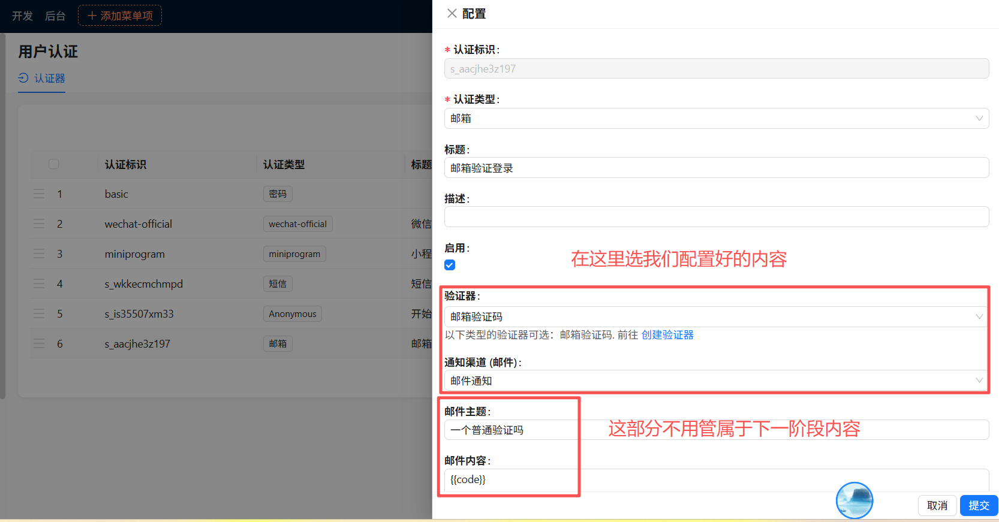

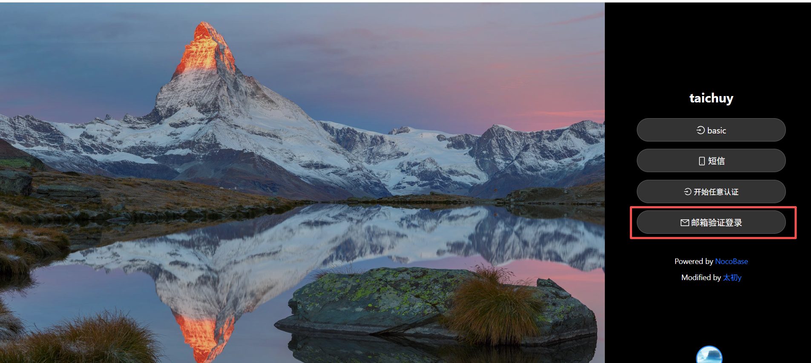


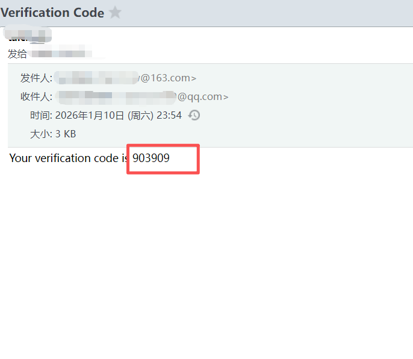

Successfully logged in by entering the verification code. For new users, registration will be automatically enabled, and it also supports email login with password verification.

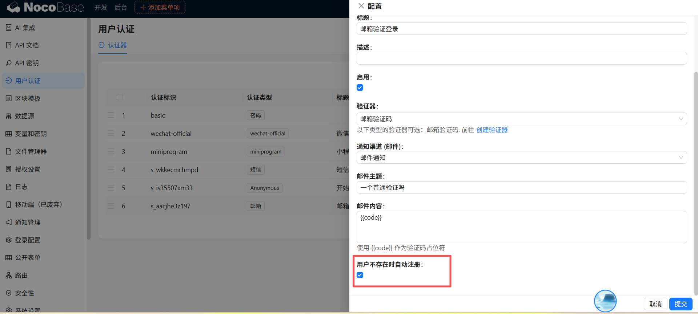

You can set whether to enable automatic registration here.
