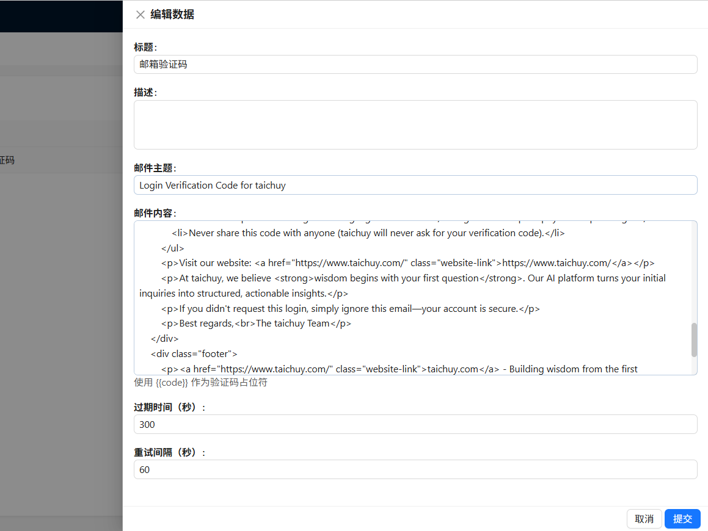
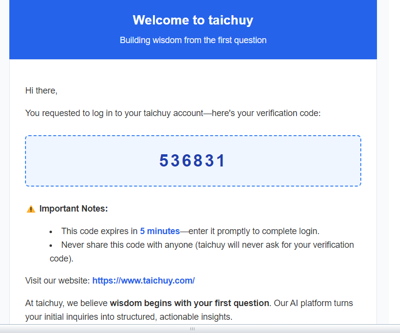
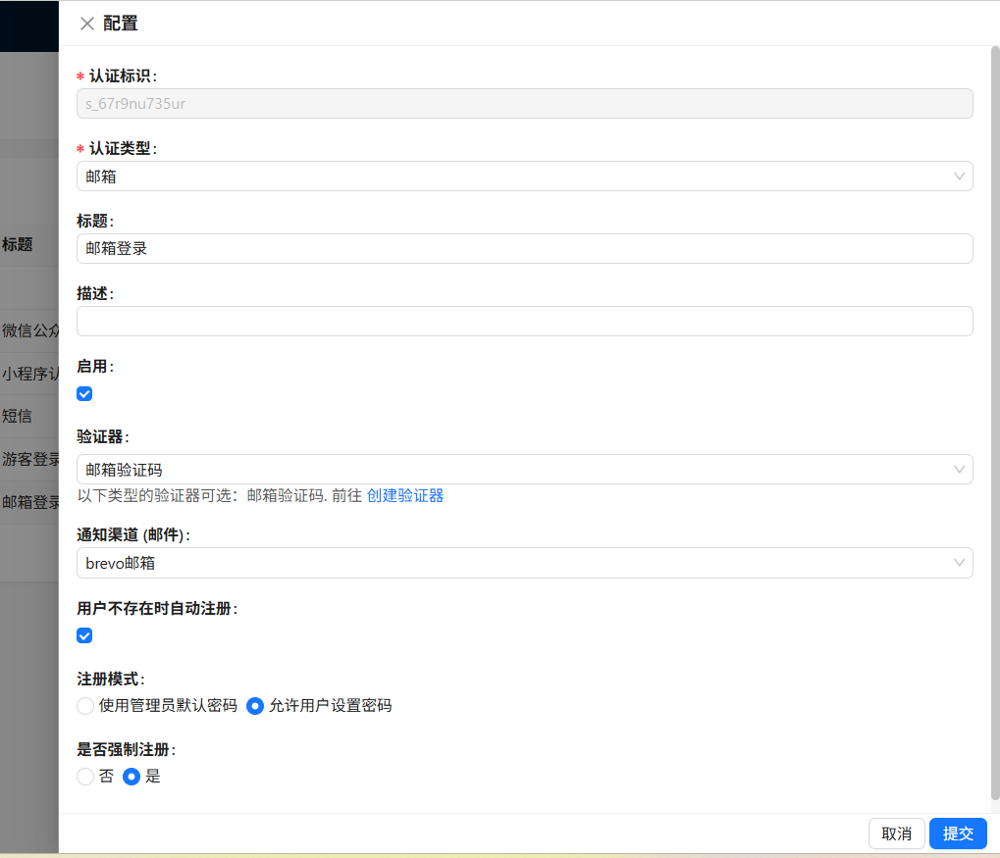
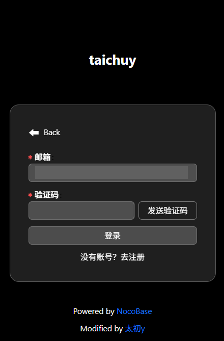
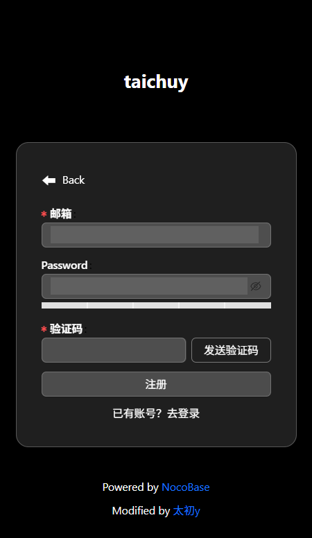
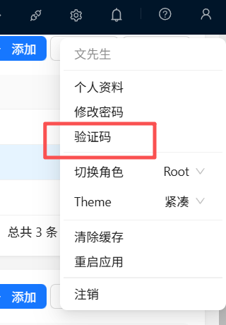
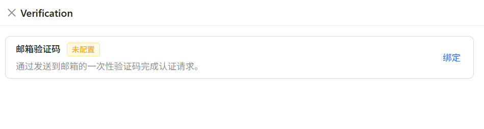
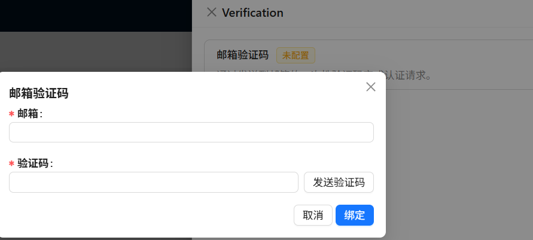

---
title: plugin-auth-email
order: 0
toc: content
---

# Taichu y Plugin - Email Authentication

## Introduction (Paid)

Enable the plugin to support email registration and login authentication in NocoBase.


### Fees:

| License Type                     | Price          | Benefits                                                                                                                                            | Suitable Scenarios                                                                     |
| :------------------------------- | :------------- | :-------------------------------------------------------------------------------------------------------------------------------------------------- | :------------------------------------------------------------------------------------- |
| **Package License**              | $49            | 1. Plugin installation package for a specific version<br>2. One-time purchase, permanent use license<br>3. Basic installation guidance              | Stable deployment in production environment without frequent updates                   |
| **Package + Source Code Access** | $99/First Year | 1. All benefits of the package license above<br>2. One year of access to the GitHub private repository<br>3. Continuous update support for one year | Need to follow NocoBase upgrades or require secondary development based on source code |
| **Source Code Renewal**          | $49/Year       | 1. Continued access to the GitHub private repository after renewal<br>2. Continuous update support during the renewal period                        | Existing package users who want to continue receiving updates                          |

For details, please visit: https://docs.taichuy.com/nocobase

## 1. Dependent Plugin Check:

The email verification plugin requires the following official native plugins to be enabled for full verification code sending functionality.


The following Email Notification plugin is disabled by default and needs to be enabled in the Plugin Manager.


## 2. Configure Email Verification:


Below is an example of my personal 163 mailbox notification configuration:


## 3. Configure Verification Code and Email Content:


Email verification code configuration content:

Among them:

```shell
Your verification code is {{code}}
```

`{{code}}` is required, which is the placeholder for the randomly generated verification code.



The email content supports HTML, so you can have AI generate a dedicated HTML for it.



## Final - Configure User Authentication


### Configuration Content Example:

After enabling automatic login for non-existent users:

1. Support automatic registration using the default password set by the administrator.

2. Support users to register and set their own passwords first, followed by one-click registration and login.








## About Email Verification (Optional)



NocoBase has a verification function. I saw it available for SMS, and SMS verification login can only be performed after enabling SMS verification. So I implemented a similar one here. However, I haven't imposed mandatory restrictions; users can still log in via email without binding. But I feel some people might find it useful later, so I've included it.





After binding the email, the user's email field attribute will be automatically updated.
