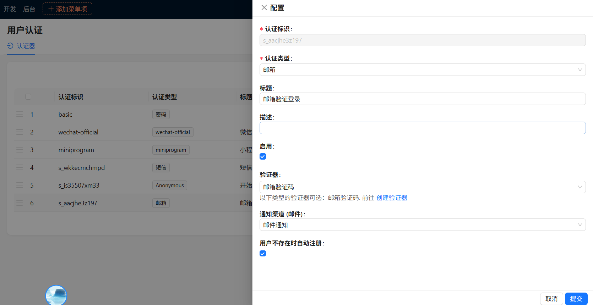
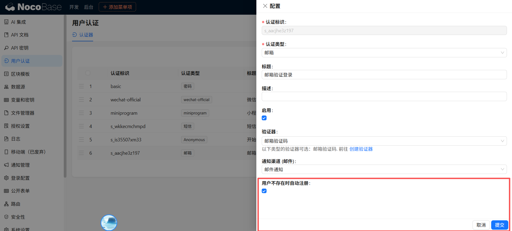

# 太初 y 的插件-邮件认证插件


## 1.依赖插件检查：

邮件验证插件需要开启下面的官方原生插件才能实现完整验证码发送


下面这个邮件通知插件默认是不开启，需要到插件管理中开启


## 2.配置邮箱验证：


下面是我个人 163 邮箱配置通知示例：


## 3.配置验证码和邮件内容：


邮件验证码配置内容：

其中：

```shell
Your verification code is {{code}}
```

{{code}}是必填的，这个就是随机生成验证码的占位符


## 最终-配置用户认证


配置内容示例：




输入验证码登录成功，对于新增用户，会自动开启注册，也支持邮箱登录验证密码



可以在这里设置是否自动注册
