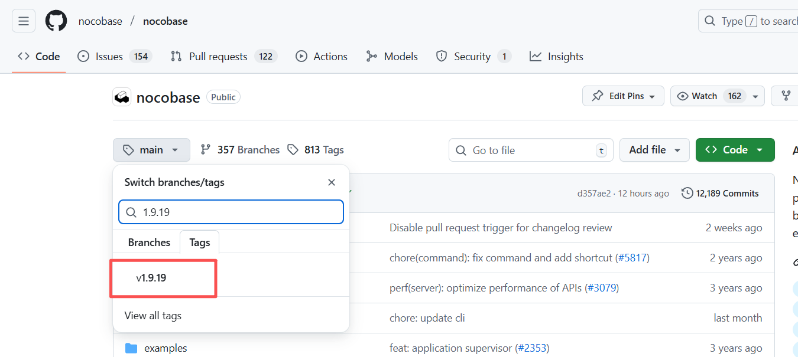
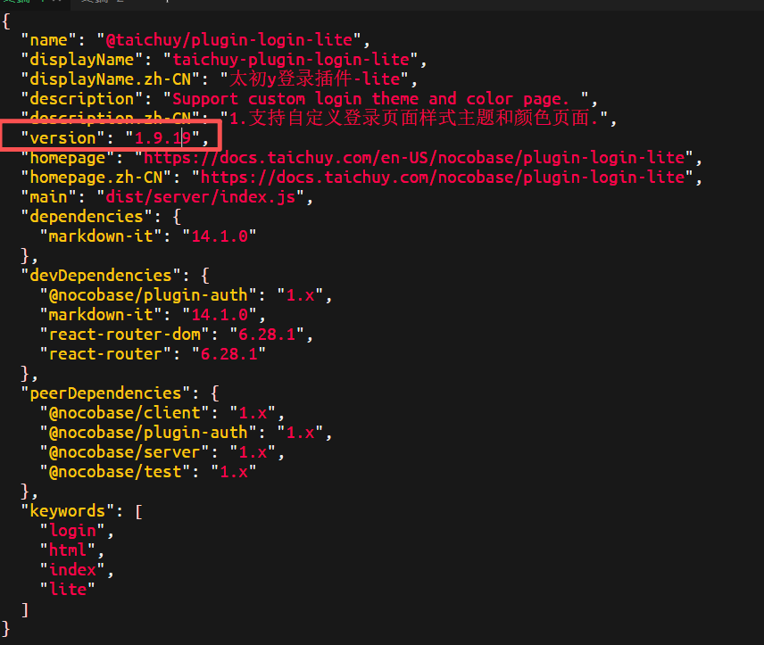
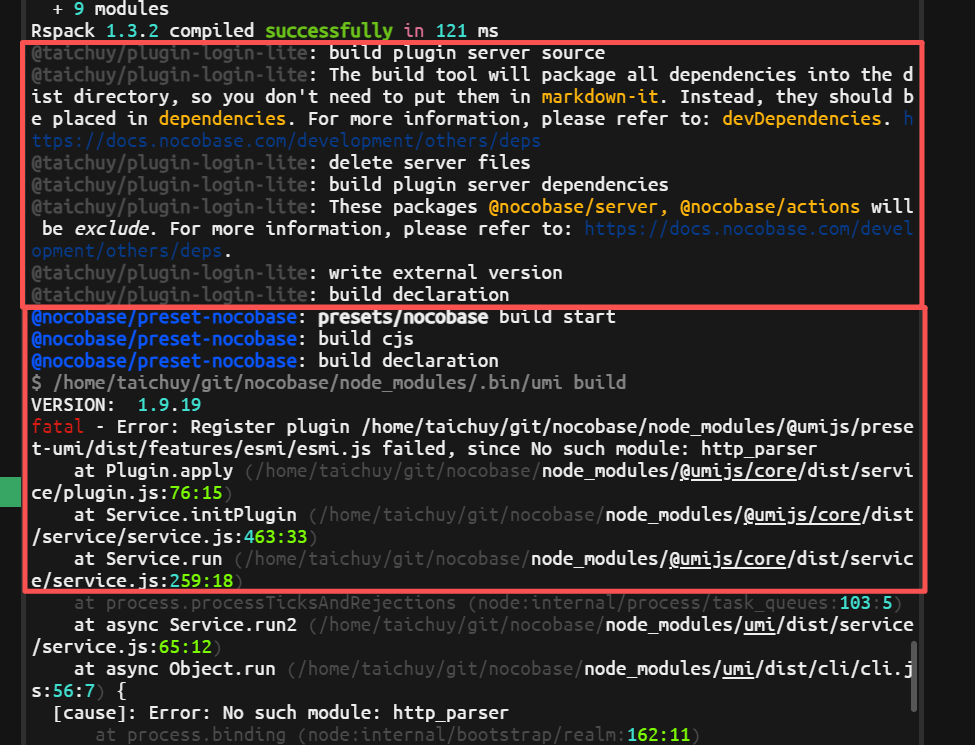

---
title: 插件打包示例
order: 0
toc: content
---

# nocobase 打包示例

## 背景说明

之前开源了一些源码插件，但是一些用户希望有一个教程能够直接怎么自己自定义打包构建，所以这篇文章就是来介绍如何从零到打包属于自己版本插件，我们以登录页面配置为开发示例。

源码下载：
nocobase-github：https://github.com/nocobase/nocobase

插件示例—首页配置插件为示例：https://github.com/taichuy/nocobase-plugin-login-lite

参考官方文档示例：

Git 源码编译下载：https://v2.docs.nocobase.com/cn/get-started/installation/git

插件打包：https://docs-cn.nocobase.com/development/your-fisrt-plugin

## 前置环境依赖：

> 请确保你已经：
>
> - 安装了 Git、Node.js 20+、Yarn 1.22.x
> - 这里只演示打包，所以数据库无所谓

## 前置准备

```shell
git clone https://github.com/nocobase/nocobase.git -b main --depth=1 nocobase
```

也可以自己去对应仓库中下载对应版本，打包指定版本插件，这里下载 1.9.19 版本演示，当前插件仓库版本为 1.9.6



进入到 nocobase 源码目录

```shell
cd nocobase
```

配置镜像（非必要：防止网络下载国漫）

```shell
yarn config set disable-self-update-check true

yarn config set registry https://registry.npmmirror.com/
```

下载依赖：

```shell
yarn install --frozen-lockfile
```

创建插件

```shell
yarn pm create @xxxx/XXXXXXX
```

例如：

```shell
yarn pm create @taichuy/plugin-login-lite
```

创建成功之后，命令检查

```shell
taichuy@taichuy-work:~/git/nocobase$ ls packages/plugins/@taichuy/
plugin-login-lite
```

## 准备好环境：

```shell
taichuy@taichuy-work:~/git$ ls
nocobase             nocobase-plugin-login-lite-main
nocobase-1.9.19.zip  nocobase-plugin-login-lite-main.zip
taichuy@taichuy-work:~/git$ ls nocobase
benchmark             generate-npmignore.sh  README.zh-CN.md
CHANGELOG.md          lerna.json             release.sh
CHANGELOG.zh-CN.md    LICENSE-AGPL.txt       scripts
cnpm-sync.js          LICENSE.txt            SECURITY.md
commitlint.config.js  locales                storage
deploy-docs-cn.sh     node_modules           tsconfig.json
deploy-docs.sh        package.json           tsconfig.paths.json
docker                packages               tsconfig.server.json
docker-compose.yml    patches                vitest.config.mts
Dockerfile            playwright.config.ts   yarn.lock
Dockerfile.pro        README.ja-JP.md
examples              README.md
taichuy@taichuy-work:~/git$ ls nocobase-
nocobase-1.9.19.zip                  nocobase-plugin-login-lite-main.zip
nocobase-plugin-login-lite-main/
taichuy@taichuy-work:~/git$ ls nocobase-plugin-login-lite-main
client.d.ts  LICENSE-AGPL.txt  README_EN.md  server.d.ts  src
client.js    package.json      README.md     server.js
taichuy@taichuy-work:~/git$
taichuy@taichuy-work:~/git$ ls nocobase/packages/plugins/@taichuy/
plugin-login-lite
taichuy@taichuy-work:~/git$
```

修改版本号与 nocobase 版本保持一致：

```shel
vim nocobase-plugin-login-lite-main/package.json
```



将插件源码拷贝过去：

```shel
rsync -av --progress --delete nocobase-plugin-login-lite-main/ nocobase/packages/plugins/@taichuy/plugin-login-lite/
```

执行命令这样就是考过去了：

```shell
taichuy@taichuy-work:~/git$ cat nocobase/packages/plugins/@taichuy/plugin-login-lite/package.json
{
  "name": "@taichuy/plugin-login-lite",
  "displayName": "taichuy-plugin-login-lite",
  "displayName.zh-CN": "太初y登录插件-lite",
  "description": "Support custom login theme and color page. ",
  "description.zh-CN": "1.支持自定义登录页面样式主题和颜色页面.",
  "version": "1.9.19",
  "homepage": "https://docs.taichuy.com/en-US/nocobase/plugin-login-lite",
  "homepage.zh-CN": "https://docs.taichuy.com/nocobase/plugin-login-lite",
  "main": "dist/server/index.js",
  "dependencies": {
    "markdown-it": "14.1.0"
  },
  "devDependencies": {
    "@nocobase/plugin-auth": "1.x",
    "markdown-it": "14.1.0",
    "react-router-dom": "6.28.1",
    "react-router": "6.28.1"
  },
  "peerDependencies": {
    "@nocobase/client": "1.x",
    "@nocobase/plugin-auth": "1.x",
    "@nocobase/server": "1.x",
    "@nocobase/test": "1.x"
  },
  "keywords": [
    "login",
    "html",
    "index",
    "lite"
  ]
}
taichuy@taichuy-work:~/git$
```

## 开始构建打包：

进入到 nocobase 项目根目录

```shell
cd nocobase
```

拷贝过去的插件是还没有下载依赖所以要：

```shell
yarn install --frozen-lockfile
```

全量整个项目都要 build 一遍时间比较长：

```shell
yarn build
```

打包插件：

```shell
yarn build @taichuy/plugin-login-lite --tar
```

这就是我们打包成功后插件可以放到你线上环境了：

```shell
taichuy@taichuy-work:~/git/nocobase$ ls storage/tar/@taichuy/
plugin-login-lite-1.9.19.tgz
taichuy@taichuy-work:~/git/nocobase$
```

### 打包注意

有时候 nocobase 打包回有奇奇怪怪的错误，你只要关注你插件有没有编译成功就好了

比如说整理已经过了我们 plugin-login-lite 的编译了，那么打包就行了

```shell
yarn build @taichuy/plugin-login-lite --tar
```



如果你想要重新尝试下载依赖可以执行：

## 重新下载编译：

```shell
yarn nocobase clean
yarn rimraf -rf node_modules
yarn install --frozen-lockfile
yarn build
```

## 太初 y 团队的 NocoBase 插件

---

我们太初 y 团队在深入使用 NocoBase 开发内部系统的过程中，积累了一系列实用插件。

秉承开源精神，我们将部分简单实用的插件开源免费分享，同时为了平衡研发成本，对一些功能复杂、开发投入较大的插件进行收费，以支持持续开发。

### 📞 联系我们

**GitHub 组织**: [https://github.com/taichuy](https://github.com/taichuy)  
**技术咨询**: 关注微信公众号 `taichuy-com` 或邮件 `taichu2021@gmail.com`

**关注公众号，了解我们最新资讯：**

在公众号中回复关键字：太初 y 的 nocobase 插件

可以获取我们已经打包好插件


