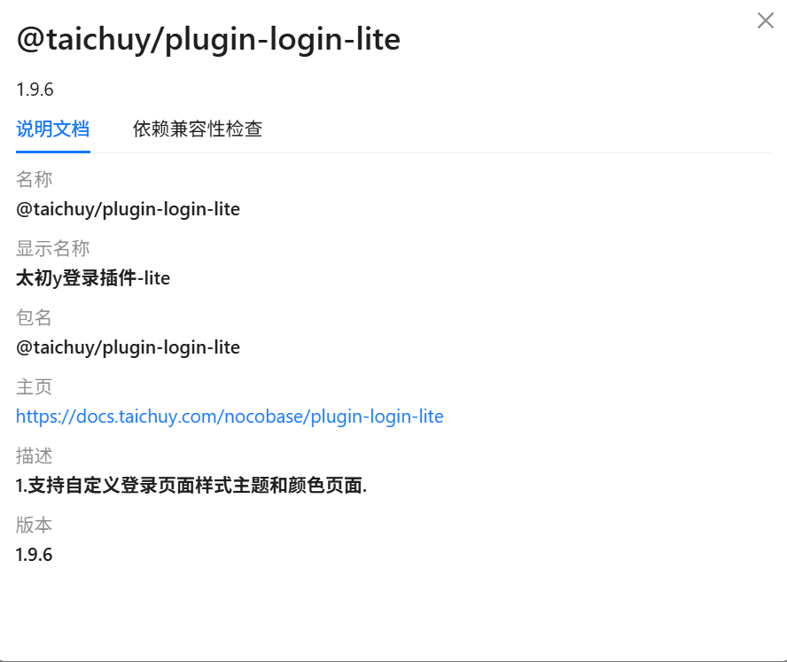
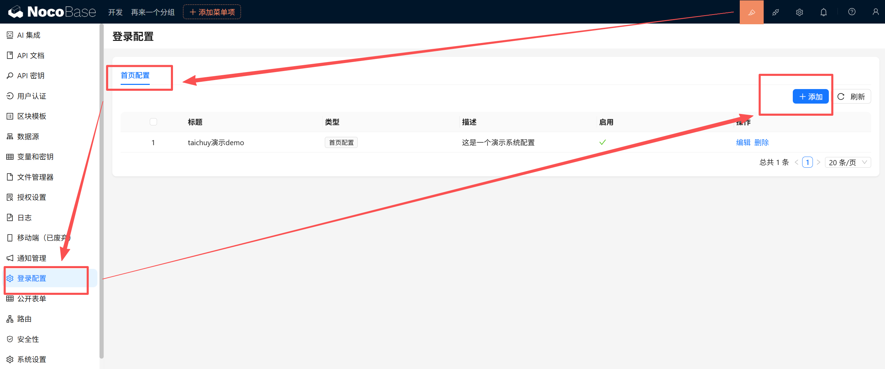
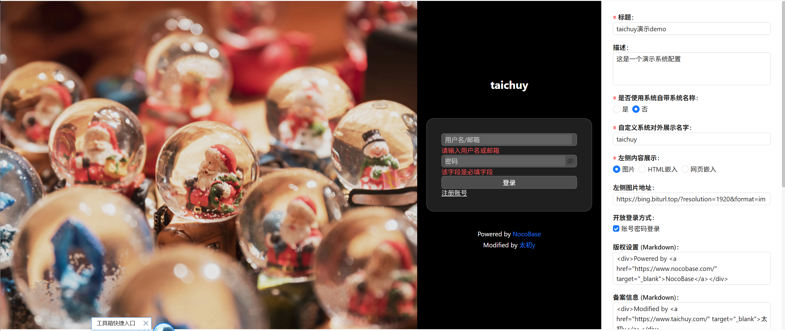

# taichuy-plugin-login-lite

@taichuy/plugin-login-lite

**English** | [简体中文](./README_CN.md)

Custom Login Page Configuration Plugin for NocoBase (Lite Version).
This plugin allows you to customize the appearance and behavior of the NocoBase login page directly from the admin panel.

## Usage

1.  **Enable Plugin**: Go to the NocoBase Plugin Manager, search for `@taichuy/plugin-login-lite`, and enable it.
2.  **Access Configuration**: After enabling, go to the admin panel and click on the "Login Configuration" menu item.
3.  **Add Configuration**: Click the "Add" button to create a new "Home configuration".
4.  **Apply Configuration**: Toggle the "Enable" switch in the configuration list to apply your settings. Only one "Home configuration" can be enabled at a time.

## Demo

Configuration Home

## Configuration Options

The following table describes the available options in the configuration form:

| Field Name                    | Type         | Description                                                                         | Default Value          |
| :---------------------------- | :----------- | :---------------------------------------------------------------------------------- | :--------------------- |
| **Title**                     | Input        | The name of this configuration (for internal management).                           | -                      |
| **Description**               | Text Area    | A brief description of this configuration.                                          | -                      |
| **Use system name**           | Radio        | Whether to display the system's application name.                                   | Yes                    |
| **Custom system name**        | Input        | Custom display name. Visible only when "Use system name" is set to "No".            | -                      |
| **Left side content display** | Radio        | Choose what to display on the left side of the login page: Image, HTML, or Webpage. | Image                  |
| **Left side image URL**       | Input        | The URL of the image to display. Visible when "Image" is selected.                  | Bing Daily Wallpaper   |
| **Webpage embed URL**         | Input        | The URL of the webpage to embed (iframe). Visible when "Webpage embed" is selected. | -                      |
| **HTML embed code**           | Text Area    | Custom HTML code to render. Visible when "HTML embed" is selected.                  | -                      |
| **Open login methods**        | Checkbox     | Select allowed login methods (e.g., Password Login).                                | Password Login         |
| **Copyright settings**        | Markdown     | Copyright text displayed at the bottom of the page. Supports Markdown.              | Powered by NocoBase    |
| **ICP filing information**    | Markdown     | ICP filing or additional footer information. Supports Markdown.                     | Modified by taichuy    |
| **Background theme color**    | Color Picker | The background color of the entire login page.                                      | #000                   |
| **Font color**                | Color Picker | The primary text color of the page.                                                 | #fff                   |
| **Login form theme color**    | Color Picker | The background color of the login form container.                                   | rgba(255,255,255,0.12) |
| **Login form text color**     | Color Picker | The text color inside the login form.                                               | #fff                   |
| **Button background color**   | Color Picker | The background color of the login button.                                           | rgba(255,255,255,0.2)  |
| **Button text color**         | Color Picker | The text color of the login button.                                                 | #fff                   |
| **Enable**                    | Switch       | Whether to activate this configuration immediately.                                 | Yes                    |

## More Features (Pro Version)

If you need more advanced features, such as **WeChat Ecosystem Integration (WeChat Official Account QR Code Login, WeChat Mini Program Unified User Authentication)**, please contact us to purchase the paid plugin. Delivery and pricing are as follows:

| License Type                     | Price        | Benefits Included                                                                                                                               | Suitable Scenarios                                                                     |
| -------------------------------- | ------------ | ----------------------------------------------------------------------------------------------------------------------------------------------- | -------------------------------------------------------------------------------------- |
| **Package License**              | $45          | 1. Specific version plugin package 2. One-time buyout, permanent usage license 3. Basic installation guidance                             | Stable production deployment, no frequent updates required                             |
| **Package + Source Code Access** | $90/1st Year | 1. Includes all benefits of Package License 2. GitHub private repository access for one year 3. Continuous update support within one year | Need to follow NocoBase upgrades or require secondary development based on source code |
| **Source Code Renewal**          | $45/Year     | 1. Continue GitHub private repository access after renewal 2. Continuous update support during the renewal period                            | Existing package users continuing to get updates                                       |

For more details: [Taichuy's NocoBase Plugins](https://docs.taichuy.com/en-US/nocobase)

## License

This project is licensed under the [AGPL-3.0](./LICENSE-AGPL.txt).

## Taichu y Team's NocoBase Plugins

---

Our Taichu y team has accumulated a series of practical plugins during the in-depth use of NocoBase to develop internal systems.

Adhering to the spirit of open source, we share some simple and practical plugins for free. At the same time, to balance R&D costs, we charge for some plugins with complex functions and high development investment to support continuous development.

### 📞 Contact Us

**GitHub Organization**: [https://github.com/taichuy](https://github.com/taichuy)  
**Technical Consultation**: Follow the WeChat Official Account `taichuy-com` or email `taichu2021@gmail.com`

**Official Account**:

